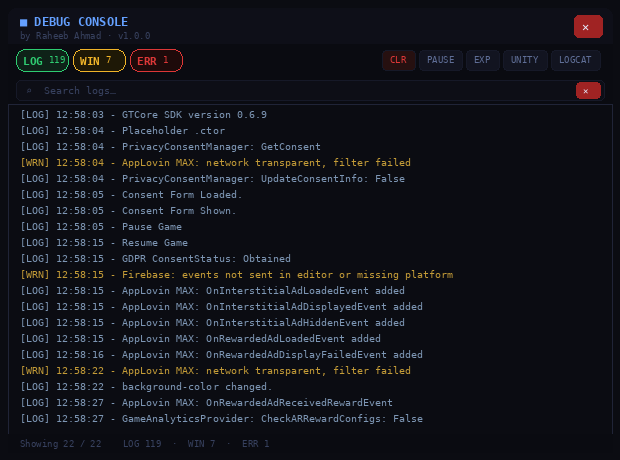
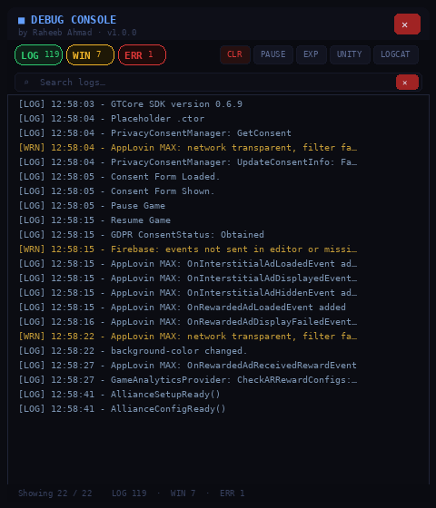
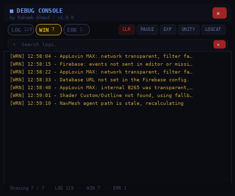
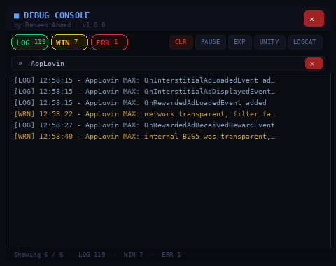
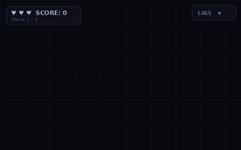
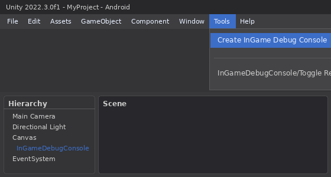
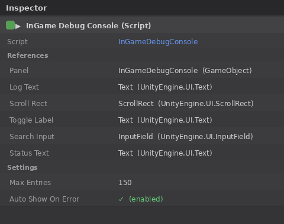

# InGame Debug Console

A lightweight runtime debug console overlay for Unity Android builds. See your logcat and Unity logs directly on-device no USB cable, no Android Studio, no adb.

   



---

## Why

Every Unity Android developer knows the pain: you ship a build, something breaks on device, and you're blind. No logs, no stack traces — just a broken screen. Connecting via adb every time kills iteration speed.

This package drops a floating console overlay into your Android build that captures both Unity logs and native logcat output in real time, with filtering and search, without any native plugins, AAR files, or Gradle configuration.

---

## Features

- **On-device logcat** — reads Android logcat filtered to your app's PID using a pure C# background thread, no AAR or native plugin required
- **Unity log capture** — hooks `Application.logMessageReceivedThreaded` to catch all `Debug.Log`, `LogWarning`, and `LogError` calls
- **Type filters** — toggle LOG / WARN / ERR independently with live counts on each button
- **Live search** — filters entries as you type, no rebuild delay
- **Auto-scroll** — sticks to the bottom on new entries, disengages when you scroll up manually
- **Auto-show on error** — optionally pops the panel open automatically when an error or exception fires
- **Zero dependencies** — no TextMeshPro, no third-party assets, pure uGUI legacy Text
- **UPM package** — install via Package Manager git URL, no manual file copying

---

## Preview

| Open | Filtering | Search | Closed |
|------|-----------|--------|--------|
|  |  |  |  |

---

## Installation

### Via Package Manager (recommended)

1. Open **Window → Package Manager**
2. Click **+** → **Add package from git URL**
3. Enter:
```
https://github.com/raheeb-ahmad/InGameDebugConsole.git
```

### Via manifest.json

Add to your project's `Packages/manifest.json`:

```json
{
  "dependencies": {
    "com.raheeb-ahmad.ingame-debug-console": "https://github.com/raheeb-ahmad/InGameDebugConsole.git"
  }
}
```

---

## Setup

1. In the Unity menu go to **Tools → Create InGame Debug Console**
   — this drops the prefab into your active scene automatically.

2. That's it. Hit Play in the Editor or build to Android.

The console appears as a small **LOGS ▼** button at the top of the screen. Tap it to open the overlay.



---

## Inspector Options

| Field | Default | Description |
|---|---|---|
| `maxEntries` | 150 | Maximum log entries kept in memory |
| `autoShowOnError` | true | Auto-opens the panel on Error or Exception |



---

## Wired Buttons (prefab child names)

If you customize the prefab, these child names must be preserved for the C# wiring to find them:

| Name | Action |
|---|---|
| `ToggleButton` | Opens / closes the console panel |
| `CloseBtn` | Closes the panel |
| `ClearBtn` | Clears all log entries |
| `LogFilterBtn` | Toggles LOG entries |
| `WarnFilterBtn` | Toggles WARN entries |
| `ErrFilterBtn` | Toggles ERR entries |

Each filter button expects a child `Text` named `CountLabel` for the live count badge.

---

## How logcat works

On Android, the console starts a background thread that runs:

```
logcat -v time --pid=<your app PID>
```

This streams only your app's logcat output. No root required. The thread uses `AndroidJNI.AttachCurrentThread()` / `DetachCurrentThread()` correctly and cleans up on `OnDisable`. If the logcat process dies (OOM kill etc.), the thread exits cleanly.

All entries are queued thread-safely using a `lock` on the entries list and a `volatile bool _dirty` flag polled in `Update()` — no `Dispatcher` or coroutine needed.

---

## Platform behaviour

| Platform | Unity logs | Logcat |
|---|---|---|
| Android build | ✅ | ✅ |
| Unity Editor | ✅ | ❌ (skipped silently) |
| iOS / PC | ✅ | ❌ (skipped silently) |

---

## Performance note

The current version concatenates all visible entries into a single `Text` component. For heavy logging (100+ entries per second) consider enabling the virtualized row pool, see the [Virtualized Scrolling](https://medium.com/@sreekanthsreekanth970/virtual-scrolling-2797d722c6e2) guide in the medium by Sreekanth.

---

## Project structure

```
InGameDebugConsole/
├── Runtime/
│   └── InGameDebugConsole.cs       # Single-file runtime, all logic here
├── Editor/
│   └── CreateInGameDebugConsole.cs # Tools menu item to add prefab to scene
├── Prefabs/
│   └── InGameDebugConsole.prefab   # Ready-to-use UI prefab
└── package.json
```

---

## License

MIT: free to use in personal and commercial projects.

---

## Author

**Raheeb Ahmad**  . Unity & AI Engineer  
[linkedin.com/in/raheeb-ahmad-48205a21a](https://linkedin.com/in/raheeb-ahmad-48205a21a) · [raheeb-ahmad.vercel.app](https://raheeb-ahmad.vercel.app)
